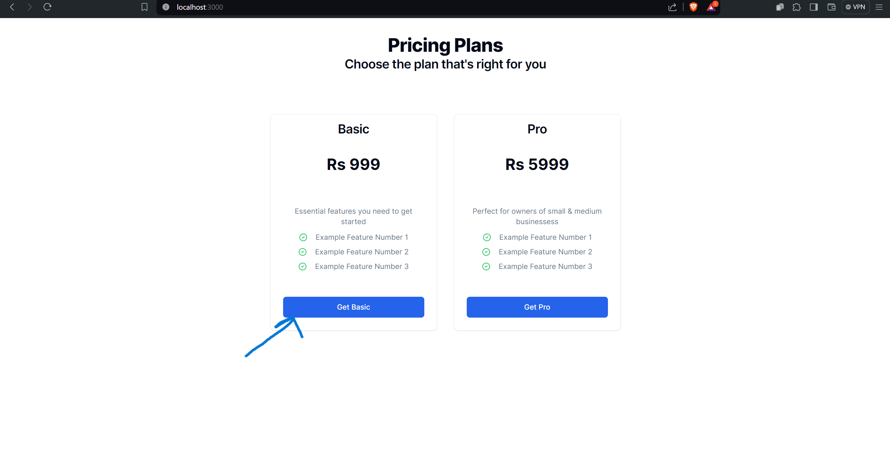

# Integrating Razorpay with Next.js

If you're selling a product or service targeting Indian audiences, then you may be using or thinking about using **Razorpay**. Razorpay is a payment gateway company that helps you accept payments online. It is being used by a wide range of companies, from Zoho to Zomato. They also offer other services like credit cards and payroll banking APIs.

### This repo will give you a general idea on how razorpay can be integrated

## Clone the repo and install the depedencies 
   ```bash
   git clone https://github.com/piyushyadav1617/razorpay-next.git
   cd razorpay-next
   npm install
   ```
## Install razorpay & Get API Keys

1. Install the necessary packages in your backend:
   ```bash
   npm install razorpay
   ```

2. Obtain your API credentials from the Razorpay dashboard (choose test/live mode). Set up the environment variables in your app:
   ```bash
   key_id="rzp_test_YOUR_API_ID"
   key_secret="YOUR_API_KEY"
   ```
3. Run the application:
   ```bash
   npm run dev #to start the application in development mode
   ```   
### pricing page


### checkout page


### razorpay window


